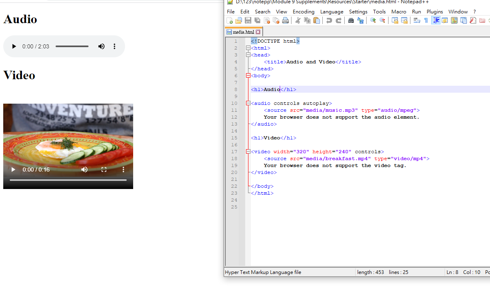

#我得第一支程式架構
 
 ```html
 <!DOCTYPE html>
<html>
<head>
 <title>MY First web programming</title>
</head>
<body>

<h1>Hello My friens</h1>

<h2>生日快樂</h2>

</body>
</html>


```
#無法顯示中文時

 ```html

<head>
插入
<title>MY First web programming</title>
	<meta charset="utf-8">
</head>


 
