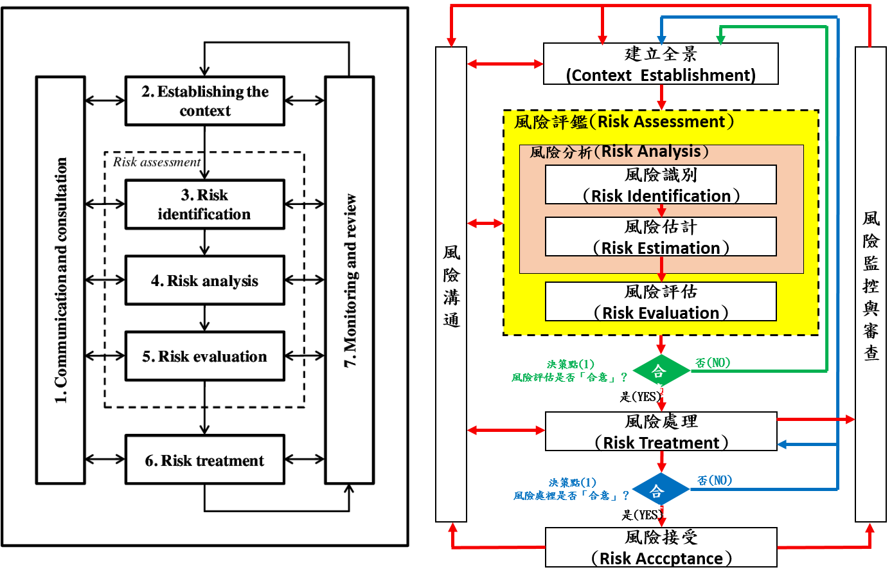

## 資訊安全管理概論

- 1.資訊安全管理概念
  - 資訊安全目標_CIA   
    - CIA: 
    - 機密性(Confidentiality):資訊不得被未經授權之個人、實體或程序所取得或揭露的性質。
    - 完整性(Integrity):確保資料無論是在傳輸或儲存的過程中，保有其正確性與一致性。
    - 可用性(Availability):確保被授權之人員能取得所需資訊。
  - 各種破壞CIA的情境
    - 範例
  ```
  學生侵入學校的伺服器，偷偷竄改自己的期末考成績。這是破壞了資訊的哪一項特性？ 答:(B)
  (A) 保密性（Confidentiality）
  (B) 完整性（Integrity）
  (C) 可用性（Availability）
  (D) 責任性（Accountability）
  ```
  ```
  組織對外服務之官方網站遭受駭客透過DDoS攻擊，請問此為下列哪項遭受破壞？ 答:(B)
  (A) 機密性
  (B) 完整性
  (C) 可用性
  (D) 可讀性
  ```
  ```
  組織內部某資料庫遭受駭客藉由惡意程式入侵，竊走大量個人資料，請問此為下列哪些特性遭受破壞？ 答:(B)
  (A) 可用性
  (B) 機密性
  (C) 完整性
  (D) 可讀性
  ```
  ```
  下列哪一種攻擊手法，主要目的是在破壞「機密性」? 答:(c)
  (1) 社交工程                      (2) 搜尋引擎攻擊(Google-Hacking)
  (3) 拒絕服務(Denial-of-Services)  (4) 駭客侵入銀行資料庫竄改存款金額
  (A) (1)， (2)  
  (B) (3)， (4)  
  (C) (2)， (3)， (4) 
  (D) (1)， (2)， (4
  ```
   - 保護CIA的方法
     - AAA:
     - 驗證(Authentication):確認身份。
     
     - 授權(Authorization):授予應得之權限。
     
     - 紀錄(Accounting):收集使用者與系統之間互動的資料，並留下軌跡紀錄。
     
     - CIA AAA
     
   - 其他資安基本觀念 
      - 鑑別性(Authenticity):識別使用者的身分，紀錄使用者資訊。
      
      - 可靠性[度] (Reliability):在規定時間內和規定的條件下，完成預定功能的能力。
      
      - 不可否認性(Non-repudiation):對已發生之行動或事件的證明，使該行動或事件往後不能被否認的能力。
      
      - 邊界與分類(Boundary and classification)
      
      - 職務區隔(Segregation of duties, SOD):衝突職務及責任範圍須區隔和分開，降低資產未經授權、非蓄意修改和誤用可能性。
      
      - 縱深防禦(Layered defense, defense in depth):形成一個類似屏障，通常是串行而不是並行的，以防止，延遲或阻止攻擊。
      
      - 單一脆弱點(Single point of failure, SPOF):系統中一旦失效，就會讓整個系統無法運作的部件，單點故障即整體故障。
      
      - 阿奇[基]里斯腱(Achilles heel):強大系統和資訊密碼，都會有致命的弱點。
      
      - 木桶理論(Bucker principle）:一隻木桶盛水多少，不取決於桶壁上最高木塊，或全部木板的平均長度，取決於最短的木板。
      
      - 僅知原則(Need to know):保密資料只讓需要知道的人知道。
      
 - 資訊安全管理系統|ISMS|Information Security Management System
 
   - 導入ISMS的目的(重要性):
     - 表達提供安全營運環境的決心與承諾。
     
     - 定義使用資訊與資訊系統的規範。
     
     - 策劃資訊安全架構。
     
     - 管理階層與全體員工溝通之依據。
  
   - 導入ISMS的過程與程序
 
     - 使用規劃、執行、檢查、行動四個步驟循環進行。
     
    - 導入ISMS的關鍵主題與事項
    ```
      主題:為何要導入ISO 27001 ?
    
      提升企業整体競爭力及形象，確保業務資訊之機密性、完整性與可用性。
      
      事項一 : ISO 27001 - 資訊安全管理系統的介紹
      
      一套完整的國際標準，協助企業持續進化，全面性架構起企業組織的資訊安全管理系統機密性、完整性及可用性，
      從事前預防、事中監控、事後應變等不同面向的管理規劃，協助企業在持續強化資訊安全管理時，也得以掌握風險管理的有效性。
      
      事項二 : ISO 27001 資訊安全管理系統必要性
      
      企業若缺少可靠與完善的資訊管理機制，可能會造成企業組織內外部的營運風險與危害，
      如：外部攻擊者的惡意入侵威脅、網路攻擊，或是內部的非授權存取、系統漏洞等，將使企業關鍵營運系統停擺、機密資料外洩，
      甚至是財務損失、商譽動搖。
      
      事項三 : ISO 27001 適用產業？
      
      由於資訊時代快速發展，ISO 27001不僅適用於現在，在未來也會持續發展，ISO 27001是目前各種類型、規模與性質的產業
      皆合適的資訊安全管理系統，作為風險管理的一環，無論是政府機關、企業都有越來越多組織實施資訊安全管理系統(ISMS)，
      甚至在不少政府部門、電子商務公司，資訊安全已成為強制性的要求。
      
      事項四 : ISO 27001 驗證有何效益？
      
      1.凸顯資安公信力，讓客戶確信自身資料受到保護
      2.遵守法規、確保營運持續
      3.降低個資的外泄風險
      4.提升品牌形象
      5.證明善盡管理責任
      6.展現最佳實務
      7.強化競爭優勢
      ```
   - 相關法規概論與遵循
     - 行政院及所屬各機關資訊安全管理要點。
     - 行政院有訂定「行政院及所屬各機關資訊安全管理規範」，供全國政府機關(構)參考施行。
     - 建立我國通資訊基礎建設安全機制計畫(94-97年)。
   - 隱私權保護與智慧財產權
     - 隱私權保護:保護個人或群體隔離自己或有關自己的信息的權利。
     - 智慧財產權:屬於無形的財產，主要涉及著作權、專利、商標等領域，概括為一切來自知識活動領域的權利。
- 2.資產與風險管理
  - 2-1.資產分類分級與盤點
   - 資訊資產
     - 資產管理(asset management) 與 資產安全(asset ecurity)
     - 資訊資產分類(類型)及分級(低中高)
     - 資訊資產分級的目的
     - 資訊資產分級的盤點施作方式
     - 範例
      ```
      關於資訊資產之擁有、使用、保管，下列敘述何者正確？ 答:(D)
       (A) 保管者（Custodian）負責獲得適當的授權，得以檢視、使用、存取或異動資訊資產
       (B) 擁有者（Owner）對於資訊資產負有管理的權責，通常由各使用者擔任或其指派之人員擔任
       (C) 使用者（User）負責資訊資產的相關處理與保管工作
       (D) 為釐清資訊資產之擁有、保管與使用的權責，確保資產由適當的人員保管及使用，
           應由各部門權責主管指定適當之擁有者、保管者與使用者
       詳解:
       
       擁有者
       
        並不是指對於資產本身擁有其財產權
        
        指實際上能夠控制資產的處理、發展、使用和安全，也就對資產負有管理職責的個人或部門。
        
      來源:https://www.netadmin.com.tw/netadmin/zh-tw/viewpoint/800CA2B1E9924718B9401618407C14F4
      ```
      ```
      資產是對組織有價值的任何事物，而資訊也是資產的一種。請問下列何種不是資訊資產？ 答:(C)
       (A) 員工人事資料
       (B) 電腦
       (C) 辦公桌
       (D) 套裝軟體
      詳解:
      
      實體資產:所有電腦設備、通信與網路設備及相關週邊設備等
      
      軟體資產:自行或委外開發之軟體、套裝軟體、公用程式等
      
      電子化資訊資產:電子儲存之文件、系統資料、組態設定檔、稽核紀錄檔等
      
      書面文件:書面管理文件與紀錄、系統相關文件等
      
      服務:通訊、網路、照明、電力等
      
      人員:正式職員、約聘人員、廠商駐點人員及工讀生等
      ```
      ```
     關於組織的資訊資產，下列敘述何者不正確？ 答:(B)
      (A) 資訊資產包含組織內與資訊活動相關的任何人事物
      (B) 資訊資產的擁有者對該資產具有實質的財產權
      (C) 資訊安全管理的目的在保護資訊資產的機密性、完整性和可用性
      (D) 資訊資產管理對資訊安全而言，其目的在於識別與資訊活動相關的資產，並予以適當的保護
      ```
      ```
     進行資產分類為下列哪一種安全控管類型?
      (A)預防性控制(Preventive)   (B)檢測性控制(Detective)
      (C)指令性控制(Directive)    (D)糾正性控制(Corrective)
      
      詳解:
      
      預防性控制 (Preventive Control):預防問題的發生
      
      偵測性控制(Detective Control):當有問題發生後把問題報告出來
      
      矯正性控制 (Corrective Control):當發現問題後將其改正
      
      來源:http://bittermelon2009.blogspot.com/2009/03/coso_23.html
     ```
     [更多範例(資產分類分級與盤點)](https://github.com/MyDearGreatTeacher/2021_2_courses/blob/main/IPAS2021/%E4%B8%8A%E8%AA%B2%E6%95%99%E6%9D%90/%E8%B3%87%E5%AE%89%E7%AE%A1%E7%90%86%E6%A6%82%E8%AB%96/%E7%AE%A1%E7%90%86_2-1.%E8%B3%87%E7%94%A2%E5%88%86%E9%A1%9E%E5%88%86%E7%B4%9A%E8%88%87%E7%9B%A4%E9%BB%9E)
  - 2-2.風險評鑑與風險處理
    - 國際標準與架構
      - NIST RMF(Risk Management Framework)
      - ISO 27005(2018)
      - ISO 31000 "Risk management – Principles and guidelines on implementation    
    - 風險管理(risk management)定義:
    
     - 一個管理過程，包括對風險的定義、測量、評估和發展因應風險的策略。
     
     - 目的:將可避免的風險、成本及損失極小化。
     
     - 理想的風險管理，事先已排定優先次序，可以優先處理引發最大損失及發生機率最高的事件，其次再處理風險相對較低的事件。
     
   - 單位內部資安管理人員應了解風險評鑑的技術，用來評鑑機關內資通系統的風險，以利於採取適當的安全防護控制措施，降低機關資安風險
   
    - 風險管理流程(Process)
    - 全景建立
      - 風險評估準則(Risk Evaluation Criteria)
      - 衝擊準則(Impact Criteria)
      - 風險接受準則(Risk Acceptance Criteria
    - 風險評鑑(Risk assessment)
      - 風險評鑑的方法 ==> 可區分為「高階風險評鑑」與「詳細風險評鑑」作法

    - 風險處理(Risk treatment) ==> 殘餘風險|剩餘風險
      - 四種風險處理{策略|模式}:
        - 1.Risk reduction = 風險降低(風險修改)
        - 2.Risk retention = 風險保留(風險接受)
        - 3.Risk avoidance = 風險避免
        - 4.Risk sharing = 風險分擔(風險轉移) 
    - 風險接受(Risk acceptance)
- 3.存取控制、加解密與金鑰管理
  - 3-1.存取控制與身份認證
    - 存取控制(Access_control)
      - 定義
      - 三大存取控制類型: 
        - 1.實體類控制(Physical Controls) 
        - 2.技術類控制(Technical Controls) 
        - 3.管理類控制(Administrative Controls)
      - [存取控制 seven功能](http://cisspstudy.blogspot.com/2007/05/types-of-access-control.html)
        - 防禦性(Preventive)
        - 偵測性(Detective)
        - 矯正性(Corrective)
        - 嚇阻性(Deterrent)
        - 復原性(Recovery)
        - 補償性(Compensation) 
      - 存取控制管理
      - Access control models存取控制模型
        - 自主存取控制(Discretionary access control)(DAC)
        - 強制存取控制(Mandatory access control) (MAC)
        - 角色存取控制(Role-based access control)(RBAC)
        - 規則存取控制(Rule-Based Access Control) (RAC)
        - 屬性存取控制(Attribute-based access control)(ABAC)
    - 身份認證(Authentication)
      - 定義
      - 三大因子(factors) 
        - 所知之事，你知| Something you `know`| the knowledge factors
        - 所持之物，你有(Something you `have`)| the ownership factors:
        - 所具之形，你是 |Something you `are` | the inherence factors
      - Single-factor authentication[單因子驗證] vs  Multi-factor authentication[多因子驗證]
    - 各種驗證方法與鑑別技術
      - 1_通行碼身分鑑別技術
      - 2_一次性通行碼(One-time Password)| 動態通行碼 鑑別技術 
      - 3_詰問與回應身分鑑別技術
      - 4_生物特徵鑑別技術 
  - 3-2.加解密與金鑰生命週期
    - 密碼學（Cryptography）: 加密 解密  明文 密文
      - 一般可分為古典密碼學和現代密碼學。
      - 古典密碼學 == > 凱薩密碼
      - 現代密碼
        - 對稱加密（Symmetric Cryptography），以 DES，3DES，AES，RC4 為代表。
          - 主要分為兩種方式：
            - 區塊編碼器（Block Cipher），又稱為塊密碼 ==> DES，3DES，AES
            - 序列密碼（Stream Cipher），又稱為流密碼 ==> RC4
        - 非對稱加密（Asymmetric Cryptography），以 RSA，ElGamal，橢圓曲線加密為代表。
        - 雜湊函數（Hash Function）==> 以 MD5，SHA-1，SHA-512 等為代表。
        - 數位簽章（Digital Signature）==> 以 RSA 簽名，ElGamal 簽名，DSA 簽名為代表。 
      - Public Key Infrastructure公開金鑰基礎建設 (PKI)
       
- 4.事故管理與營運持續
  - 4-1.事件與事故管理
    - 資安事故(Security Incident)與資安事件（Security Event）
      - 資安事故(Security Incident) ==> 尚未對組織或單位造成損失
      - 資安事件（Security Event） ==>對此資安事件已對組織或單位的資產造成損失
    - 資訊安全事件通報
      - 行政院國家資通安全會報通報及應變作業流程 
    - 資安事故應變與處理程序(循環)
  - 4-2.備援與營運持續
    - 備援
    - 重要觀念
    - 目標回復時間 (Recovery Time Objective, RTO):關鍵業務從事故發生到完成回復最低運作水準之可接受時間。
    - 資料回復點目標 (Recovery Point Objectives, RPO): 資料中心能容忍的最大資料遺失量
    - 最大可容忍的中斷時間（Maximum Tolerable Period of Disruption， MTPD）:關鍵業務發生中斷後，恢復至最低運作水準，所能容許的中斷時間。
    
    - 備份方式1
    - 完整備份（Full Backup）
    - 差異備份（Differential Backup）
    - 增量備份（Incremental Backup）
    - 選擇式備份（Selective Backup）:對系統的一部分進行備份。
  
    - 備份方式2
    - hot備份
    - WARM備份
    - COLD備份
  
    - 備份方式3
    - LOCAL 備份
    - REMOTE 備份(remote backup)

    - 備份管理
    
  - 營運持續
    - 營運持續(Business continuity)
    - BCP(Business continuity `planning`) 業務連續性`計畫(規劃)`
    - BCM(Business Continuity `Management`)業務連續性`管理`
    -  (Business continuity planning)
    - 營運持續管理的國際標準 ISO 22301
    - 營運持續步驟:
      - 1_建立業務持續運作`策略`
      - 2_營運衝擊分析(Business Impact Analysis):BIA
        - BIA的步驟:
          - 識別組織的關鍵業務功能
          - 計算關鍵業務
          - 最大可承受中斷時間 (Max. Tolerable Period of Disruption, MTPD)
          - 目標回覆時間(Recovery Time Objective, RTO)
          - 各營運活動可容忍資料遺失之期間(Recovery Point Objective, RPO)
          - 最低服務水準 (Min service level) 
      - 3_識別`防禦性`控制措施
      - 4_發展復原策略
      - 5_發展營運持續計畫
      - 6_測試與演練
      - 7_維護營運持續計畫
